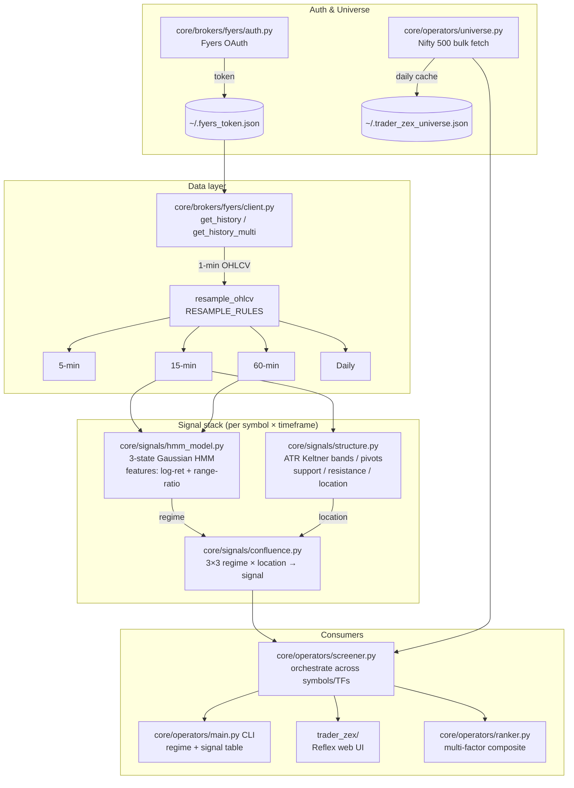
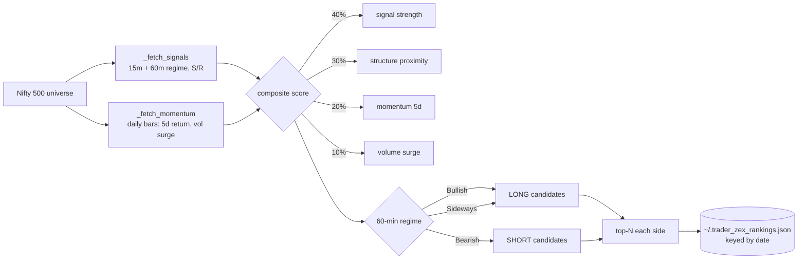
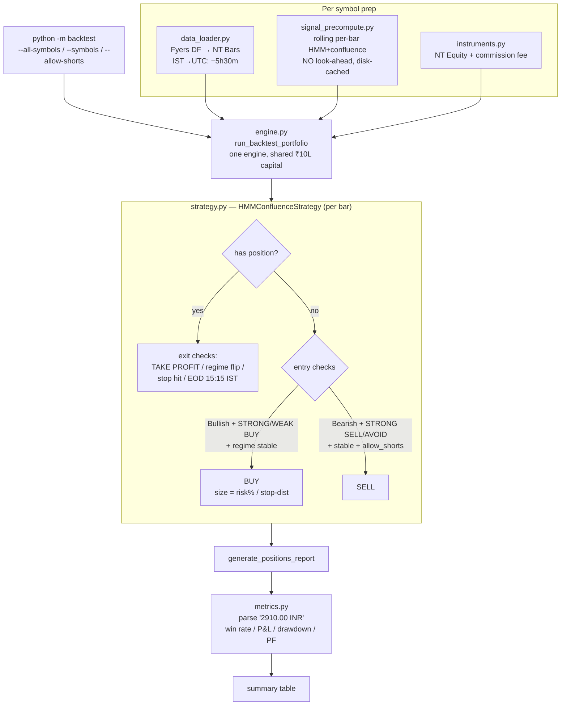

# Trader Zex — Architecture & Data Flow

## 1. High-level pipeline

## 2. The ranker (daily candidate selection)

## 3. The backtest (NautilusTrader 1.226)

## 4. Key design invariants

| Concern | How it's handled |
|---------|-----------------|
| Look-ahead bias | Signals use expanding window `bars[:i+1]` only (`signal_precompute.py`) |
| Survivorship guard | `--use-ranker` prints & **exits**; never picks symbols for historical backtest |
| Position state | Derived from `portfolio.is_net_long/short`, not a manual field |
| Timezone | IST-naive − 5h30m → UTC ns; EOD bars open 09:15 IST → 03:45 UTC |
| Cache invalidation | Signal cache key includes a hash of HMM/structure config |
| Short selling | Requires `AccountType.MARGIN`; off by default (`allow_shorts=False`) |
